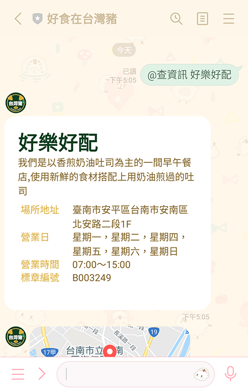
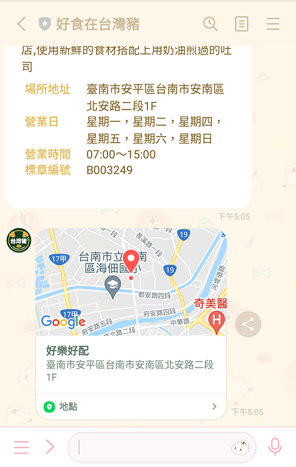
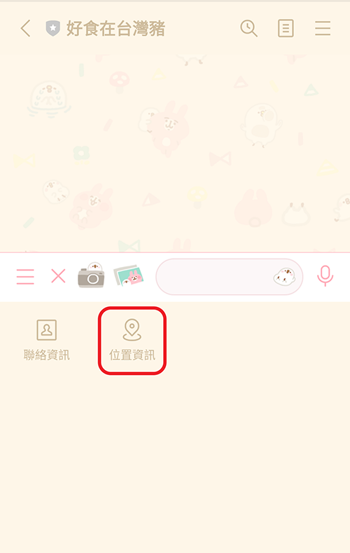
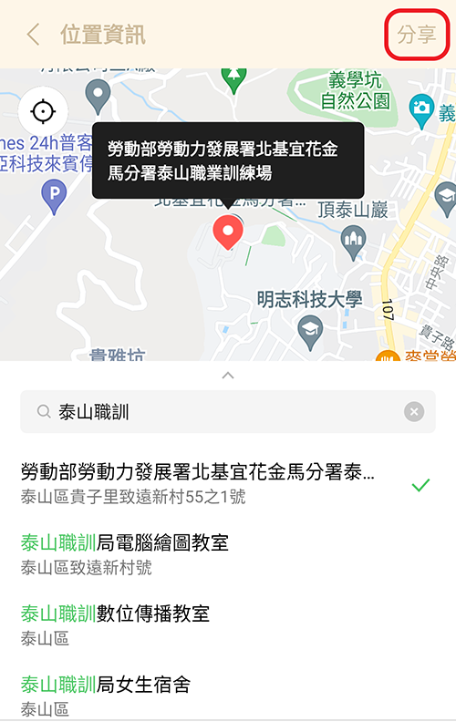
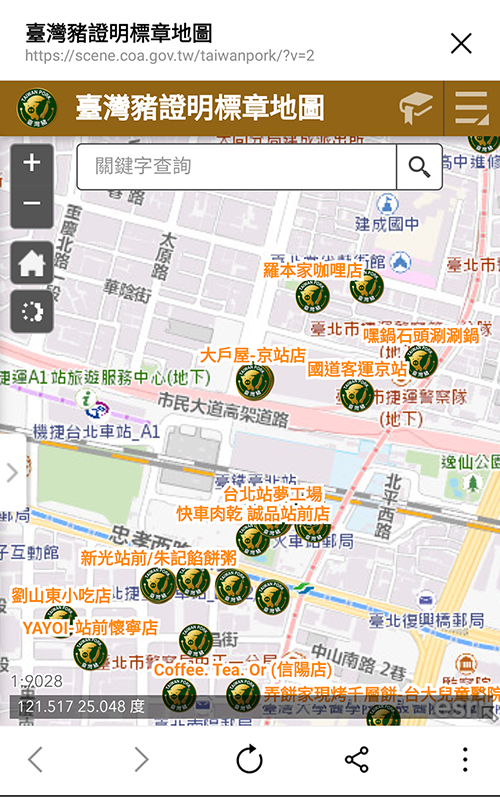

# 好食在台灣豬👍🐖🍽 — line機器人
想找尋最道地的台灣豬嗎？

透過此機器人可以查詢商家是否擁有行政院農委會認證的`臺灣豬證明標章`，並且查詢商家的`地址`和`營業時間`。

另外也可以`找尋身邊`或`任意座標位置`附近擁有此認證標章的販售、餐飲、製造商家。

## 導覽
* [加為好友](#addFriend)
* [使用方法](#directions)
  - [閱讀功能指令](#read)
  - [確認商家標章的真偽](#check)
  - [查詢認證商家的詳細資料](#info)
  - [透過定位尋找認證商家](#map)
  - [前往「台灣豬認證標章地圖」](#link)
* [資料來源](#dataSource)

## 加為好友
* 透過 line ID：`@586cmshp`
* 點擊 [加入好友](https://line.me/R/ti/p/%40586cmshp)
* 掃描 QRcode

## 使用方法
### 閱讀功能指令

輸入「@指令」或點選下方選單的「閱讀指令」

機器人會回覆指令的使用說明

### 確認商家標章的真偽
輸入「@查標章 商家名稱」

例如：@查標章 皇品自助餐

機器人會回覆商家是否有認證標章

如果商家擁有會顯示標章編號及有效期限，沒有的話會回覆「商家未申請」。

### 查詢認證商家的詳細資料
輸入「@查資訊 商家名稱」

例如：@查資訊 好樂好配

機器人會回覆商家的資訊、地址、營業時間、標章編號，並傳送地圖位置。

### 透過定位尋找認證商家
點選下方選單左邊箭頭裡的「＋」號，接著點選「位置資訊」

選擇地點位置，按下右上方的「分享」，即可查詢

機器人會回覆那個地區附近擁有台灣豬標章的商家，並顯示地圖和地址。

### 前往「台灣豬認證標章地圖」
點選下方選單的「標章地圖」

會連結到「台灣豬認證標章地圖」網站，可以查詢更完整的資訊。

## 資料來源
此機器人使用 [政府資料開放平臺 臺灣豬證明標章商家資料](https://data.gov.tw/dataset/136370) 提供的資料

